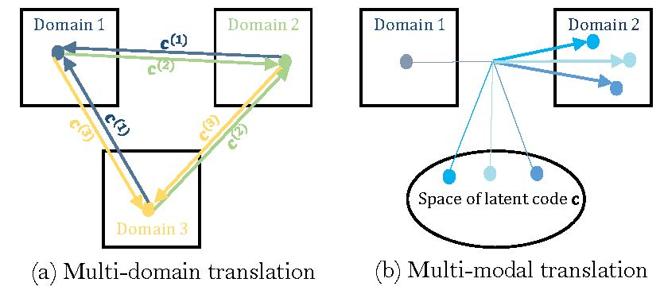
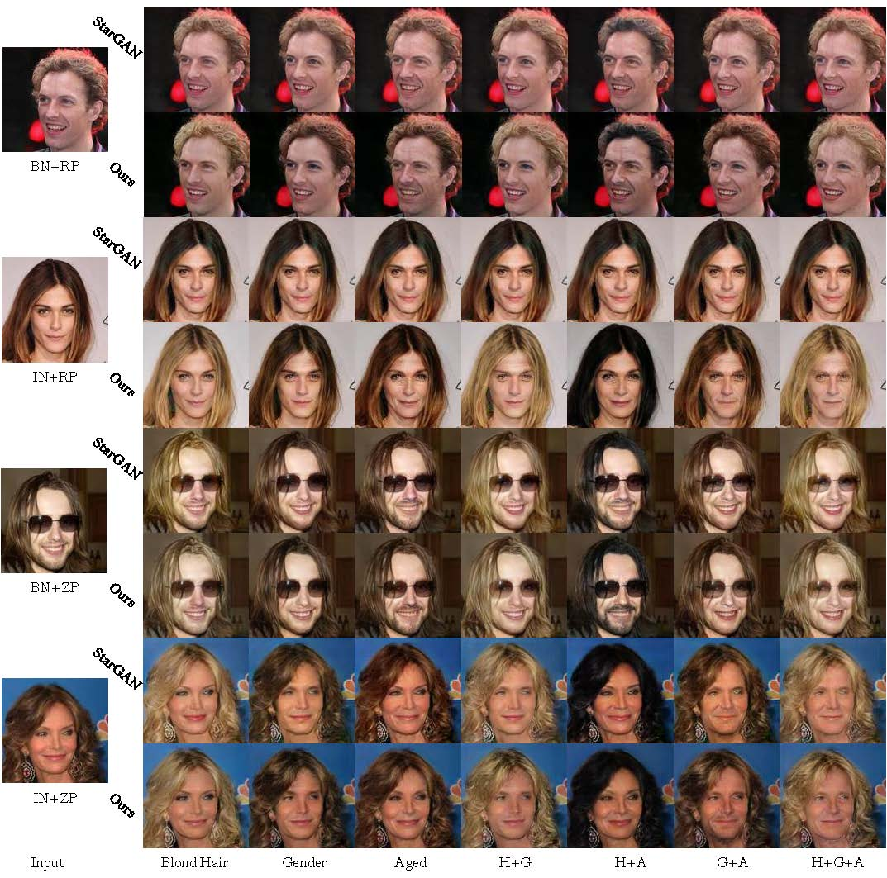
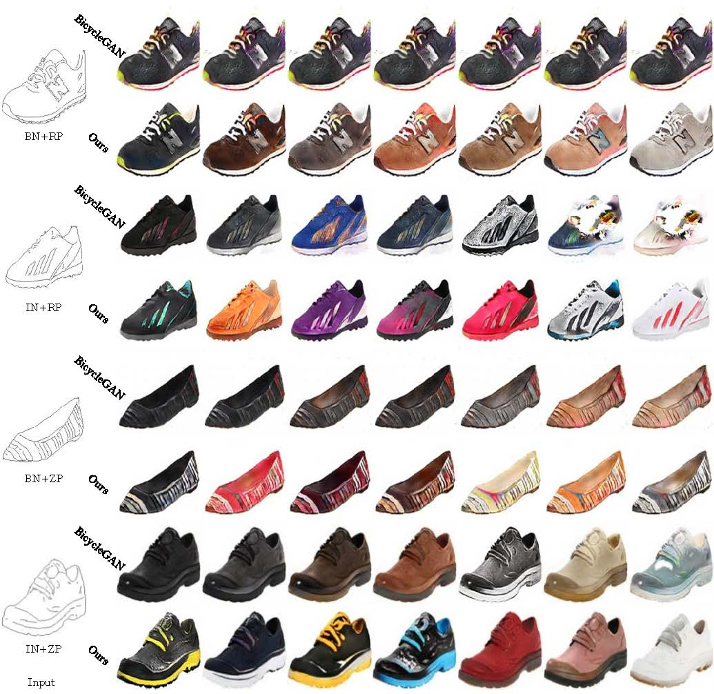

# CBN-translation
["Multi-Mapping Image-to-Image Translation with Central Biasing Normalization"  arXiv preprint arXiv:1806.10050 (2018).](https://arxiv.org/abs/1806.10050)
Pytorch implementation of *Central Biasing Normalization*  for multi-mapping image-to-image translation.

 Multi-Mapping translation  can be classified as multi-domain mapping and multi-modal mapping problems.
Multi-domain translation focuses on learning  the mappings across differnt attribute domains, such as  the transformation of different hair colors.
Multi-modal  aims to model a distribution of possible outputs while perform mapping between two specific domains, such as the synthesization  of different style bags by same sketch image.

 

I will release code and  pretrained models ASAP.
## Results
| Strategy | Description |
| :---: | --- |
|ZP| Zero padding is applied for convolution inputs
|RP| Reflection padding is applied for convolution inputs
|BN[1]| Batch normalization for convolution outputs (CBBN is used in our model)
|IN[2]| Instance normalization for convolution outputs (CBIN is used in our model)

| Method | Description |
| :---: | --- |
|StarGAN[3]| Multi-domain translation model with latent code injection
|BicycleGAN[4]| Multi-modal translation model with latent code injection
|Our| Multi-mapping translation model with center biasing normalization

### Multi-domain Translation on  Facial Attribute

### Multi-modal Translation on  Edges2Photos

### Reference
> 1. *Ioffe S, Szegedy C. Batch normalization: Accelerating deep network training by reducing internal covariate shift[J]. arXiv preprint arXiv:1502.03167, 2015.*
> 2. *Ulyanov D, Vedaldi A, Lempitsky V. Improved texture networks: Maximizing quality and diversity in feed-forward stylization and texture synthesis[C]//Proc. CVPR. 2017.*
> 3. *Choi Y, Choi M, Kim M, et al. StarGAN: Unified Generative Adversarial Networks for Multi-Domain Image-to-Image Translation[J]. arXiv preprint arXiv:1711.09020, 2017.*
> 4. *Zhu J Y, Zhang R, Pathak D, et al. Toward multimodal image-to-image translation[C]//Advances in Neural Information Processing Systems. 2017: 465-476.*

### Contact
Feel free to reach me if there is any questions (Xiaoming-Yu@pku.edu.cn).

